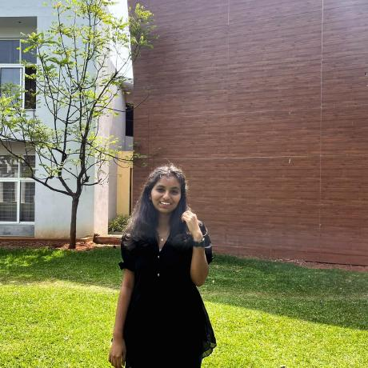

  

<h1 align="center">👋 Hello, I'm Bhoomika Marigoudar</h1>

  
  

## 👨‍💻 About Me

- 🎓 I'm currently pursuing a Computer Science and Artificial engineering degree at KLE Technological University,Hubli.
- 💼 I'm passionate about Problem Solving,System design and Web development.

## 🛠 Tech Stack

## 📊 GitHub Stats

  

  

<!-- ## 🏆 GitHub Trophies

  

 -->

## 📈 Most Used Languages

  

<!-- ## 🚀 Featured Projects

  
  

 -->

---

  

<h3 align="center">💖 Thank you for visiting my profile! 💖</h3>
